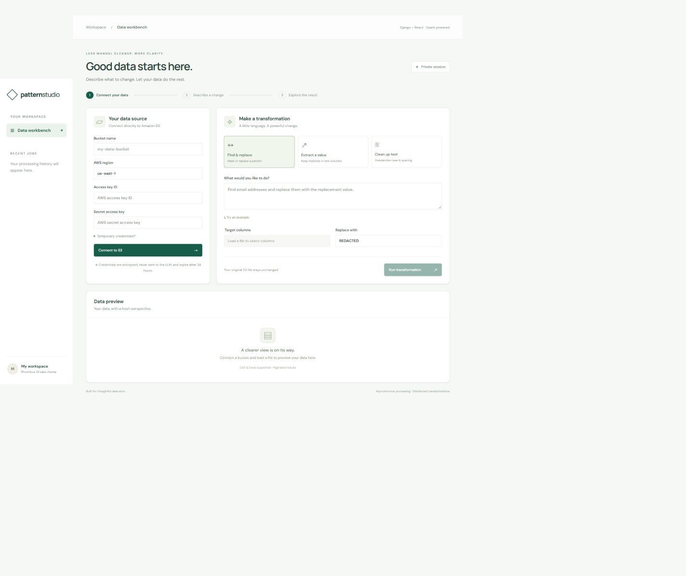
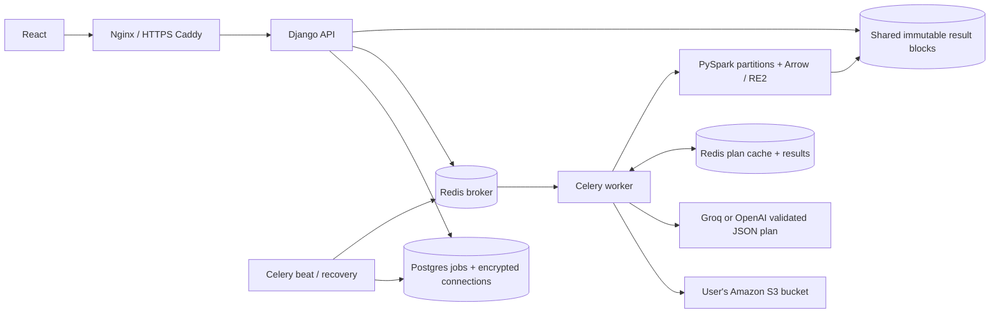

# Pattern Studio

A Django + React workbench for transforming S3 data with natural language. Celery runs ingestion and planning asynchronously; PySpark distributes transformations across partitions; Arrow's RE2 kernels perform regex work without backtracking.



> Live application: https://pattern-studio-ms-2026.japaneast.cloudapp.azure.com/ . Public HTTPS, health and session endpoints are verified. Real S3/LLM integration and the demonstration video remain pending; this is not yet a complete submission. See [submission checklist](docs/SUBMISSION.md) and [verification evidence](docs/VERIFICATION.md).

## Run

Prerequisites: Docker Engine/Desktop with Compose v2, Python 3 for initial secret generation, and a Groq API key for the default environment (or an explicitly configured OpenAI API key). Allow at least 6 GB memory for the default stack; the optional Spark cluster requires more. No preconfigured AWS bucket or credentials are required.

The supplied environment defaults to Groq's `openai/gpt-oss-20b`, with a 100-call daily application budget and no automatic fallback to a paid provider. Provider quotas apply separately; cached plans do not consume this application budget. See [hosting progress](docs/AZURE_STATUS.md) for the pending Azure student deployment.

```sh
python scripts/configure.py
# Edit .env and set GROQ_API_KEY (default provider). Do not commit this file.
docker compose up --build -d
```

Open **http://localhost:8080**. Migrations run automatically before the API and workers start. The application starts without an LLM key, but transformations return an explicit configuration error until one is supplied. There is no production mock-LLM fallback.

Enter your own AWS access key, secret key, optional temporary-session token, bucket and region. Browse by prefix, select a CSV/Excel file, and click **Load & preview file**. Select columns, choose a mode, write a natural-language instruction, and run the transformation. Follow the status/progress and browse the result pages. The original S3 object is never modified.

```sh
docker compose logs -f worker api
docker compose ps
docker compose down                 # preserves volumes
```

Flower runs on **http://localhost:5555**, bound to loopback and protected with the generated `FLOWER_USER` / `FLOWER_PASSWORD`. Do not expose Flower, Redis, Postgres, or Spark ports to the public internet.

## Transformations

| Mode | Example instruction | Behavior |
| --- | --- | --- |
| Find & replace | Find email addresses | Replace all matches in selected columns with the exact replacement value. Empty replacement deletes matches. |
| Extract a value | Extract the first email address from each cell | Append `<column>_extracted`; preserve originals; unmatched and null cells yield null. |
| Clean up text | Trim, collapse spaces and convert to lowercase | LLM chooses an ordered allowlist of trim / lowercase / uppercase / collapse_spaces operations. |

The LLM returns a small typed JSON plan, never executable code. RE2 and the actual Arrow execution dialect both validate generated regexes. Lookaround and backreferences are intentionally unsupported. Nested quantifiers execute through RE2 rather than Java/Python backtracking engines. User replacement strings are literal (including `$` and backslashes). Plans are cached for 24 hours in Redis under a hash of model, mode, prompt and planner version. Cache hits are shown in the UI. LLM variability means semantic accuracy still needs review: the applied regex/operations and explanation are displayed with every transformation result.

## Architecture



`pipeline/views.py` owns HTTP, validation, session isolation and bounded result reads. `pipeline/tasks.py` owns job orchestration, state transitions, retries, cancellation and recovery. `pipeline/services/` owns S3, credentials, planning and Spark transformations. Job status is authoritative in Postgres, independently of Celery's transient state. Redis provides the broker, result backend, and plan cache in separate logical databases.

Connection/list, file inspection, and transformation are separate asynchronous job types. Submission commits a `QUEUED` database row and returns HTTP 202 with a UUID. Only the UUID goes into the queue. Publishing uses a short connection timeout and no inline retries. Beat republishes committed queued rows every 30 seconds, making the row a simple persistent outbox if enqueueing fails. Duplicate deliveries claim a job atomically and return without repeating successful work. This outbox favors recoverability over an exact-once promise.

Jobs transition `QUEUED → RUNNING → SUCCESS / FAILED / CANCELLED`. Progress is honest stage-based progress, not a fabricated row-level percentage. Workers heartbeat every three seconds. Transient S3/network/LLM failures retry at most three attempts total; access-denied and invalid-input errors fail immediately. Every attempt writes to a unique directory. Only the successful attempt's manifest is published. A monitor cancels the Spark job group when cancellation is requested; source downloads and Excel parsing check cancellation incrementally. An in-flight LLM request may take up to its 45-second timeout to return. Cancellation is a request, not an instantaneous kill guarantee. Stale workers are recovered after two minutes; fencing tokens prevent old attempts from publishing a new result.

## Distribution, memory and pagination

The default Compose uses `local[2]`: a real Spark engine with two local threads, suitable for a reviewer laptop. This is **not** a multi-machine deployment. For a real standalone Spark master and multiple executor processes:

```sh
docker compose -f compose.yaml -f compose.distributed.yaml up --build -d --scale spark-executor=2
```

The optional topology is supplied for verification; its actual validation status is recorded in the verification document. For multiple physical hosts, replace the Compose volume with a shared filesystem mounted as `/data` everywhere, distribute the same application image, configure Spark networking, and size executor memory. Merely changing `SPARK_MASTER` without shared storage is insufficient.

Files stream from S3 to task-local disk inside the shared volume, keeping AWS secrets out of Spark configuration and executor logs. Download is one stream per input file, with a 5 GiB default limit. CSV parsing uses explicit string columns to preserve identifiers/leading zeros and repartitions to 8 partitions (16 in the standalone overlay). Increase partition count based on executor cores and data size, aiming for a small multiple of cores and roughly 64–128 MiB per partition; validate the choice by benchmark. No complete dataset is collected into the driver or sent to the LLM.

Quoted multiline CSV is supported by default (`CSV_MULTILINE=true`); Spark cannot split a single multiline CSV efficiently at ingestion. Set `CSV_MULTILINE=false` only for ordinary one-record-per-line CSV to enable splittable input. Both modes redistribute data for the transformation phase. XLSX uses openpyxl read-only iteration to a temporary CSV; legacy XLS uses xlrd and is less memory-efficient. Excel ingestion is single-worker and capped at 100 MiB, uses the first sheet, and reads cached formula values. Large workbook users should export CSV. These are explicit ingestion tradeoffs, not claims of distributed Excel parsing.

Spark pandas UDFs send Arrow batches of up to 4096 rows to native Arrow kernels. Matching/replacement/normalization run in vectorized native code across Spark partitions, not a Python driver row loop. Result serialization iterates rows **inside each executor** solely to write bounded 500-row JSON blocks. The driver collects only one count/path descriptor per partition. HTTP pagination reads the relevant blocks directly; it never launches Spark or scans preceding rows. API pages are capped at 100 rows (UI 25). Order is stable within a completed job but not promised to equal source order or another run's order. No global sort/shuffle is added solely for display.

## Security and retention

- Fernet encrypts AWS credentials at rest; the key is supplied separately through environment configuration. A 24-hour token TTL prevents reuse after expiration. API responses, queue payloads, logs, and frontend persistence never include credentials. Session-token input supports temporary AWS credentials.
- The LLM receives only the user's instruction and mode. Do not put secrets into natural-language instructions. Prompts are not dataset samples.
- Session-bound UUID ownership checks apply to connections, source jobs, results, status and cancellation. Django CSRF middleware protects mutations; cookies use HttpOnly and SameSite=Lax, and Secure in HTTPS deployment. The browser renders cell values as React text, not HTML.
- Public deployments require HTTPS. Server and client validation, input limits, Nginx rate limiting, per-session active job limits and service timeouts constrain resource use. There are no arbitrary user-supplied S3 endpoints.
- Results/source copies are stored on the server volume, not encrypted by the application. Use encrypted disks and restrict host access for sensitive datasets. Dataset retention is 24 hours plus the hourly cleanup interval; running jobs are not deleted. Disconnect deletes the connection and files once workers have stopped. LLM plans expire separately after 24 hours.
- This is a bounded take-home application, not a production multi-tenant SaaS. Anonymous sessions are intentionally easy for reviewers; production needs login, stronger global admission control/quotas, storage quotas, secret-manager integration and audit policies. A new session can circumvent per-session quotas. Deploy with monitoring and a spend limit.

Minimum S3 permissions (replace the bucket name):

```json
{"Version":"2012-10-17","Statement":[
  {"Effect":"Allow","Action":["s3:ListBucket"],"Resource":"arn:aws:s3:::YOUR_BUCKET"},
  {"Effect":"Allow","Action":["s3:GetObject"],"Resource":"arn:aws:s3:::YOUR_BUCKET/*"}
]}
```

SSE-KMS objects additionally require the appropriate KMS decrypt permission. The application never writes to the user's S3 bucket. Credentials must reach the intended bucket in the selected region; failures return a safe actionable message without echoing provider exception bodies.

## API

All endpoints use the same-origin Django session. First call `GET /api/session/` and use its `csrf` value in `X-CSRFToken` for POST requests.

| Method / path | Purpose |
| --- | --- |
| POST `/api/connections/` | Encrypt credentials and queue S3 listing; returns connection and job IDs |
| POST `/api/jobs/submit/` | Queue `list`, `inspect`, or `transform` |
| GET `/api/jobs/` | Recent jobs for this session |
| GET `/api/jobs/{id}/` | Status, progress, safe error and plan |
| GET `/api/jobs/{id}/result/?page=1&page_size=25` | Bounded, stable result page |
| POST `/api/jobs/{id}/cancel/` | Request cancellation |
| POST `/api/connections/{id}/disconnect/` | Delete inactive session connection and its data |
| GET `/api/metrics/` | Session-scoped job counts by status |
| GET `/api/health/` | API liveness (not full-stack readiness) |

## Tests and benchmark

```sh
docker compose exec worker pytest -q
docker compose exec worker python scripts/benchmark.py 1000000
python scripts/generate_dataset.py --rows 1000000 --output artifacts/million.csv
```

The benchmark executes the real Spark replacement/materialization path and verifies **every output row** for count, uniqueness and correct replacement, using bounded row blocks and a one-byte-per-row ID bitmap. It reports runtime, throughput, partitions and page latency. Synthetic benchmark timing excludes S3 and LLM: upload the generated CSV to a test bucket and run it through the UI for the full end-to-end test. No benchmark number is claimed without recorded output. Generated source data contains synthetic addresses only.

Tests cover literal replacement, null handling, extraction, normalization, unsafe regex syntax, a pathological backtracking pattern on RE2, cross-block/partition pagination, plan caching, credential encryption, CSRF, ownership isolation, cancellation, duplicate delivery, transient retries and worker-loss recovery. A real Spark test exercises CSV parsing, replacement, extraction, normalization and materialization. GitHub Actions runs it on Linux with Java 17, plus the frontend API tests and build. `backend/requirements.txt` describes dependency ranges; `requirements-lock.txt` records exact resolved versions used by Docker/CI, excluding the local-only Java helper. `frontend/pnpm-lock.yaml` pins frontend dependencies.

## Deployment and demonstration

See [docs/DEPLOYMENT.md](docs/DEPLOYMENT.md) for the HTTPS server procedure and [docs/DEMO_SCRIPT.md](docs/DEMO_SCRIPT.md) for a 2–3 minute recording plan.

**Live URL:** pending — no public deployment yet.

**Demo video:** pending — record the real S3 → asynchronous transformation → paginated result flow and embed/link the resulting video here before submission. A mock-data screen recording is not a substitute.

## References

- [Spark 3.5 documentation](https://spark.apache.org/docs/3.5.7/): execution engine and configuration.
- [Celery task documentation](https://docs.celeryq.dev/en/stable/userguide/tasks.html): retries and delivery semantics.
- [RE2](https://github.com/google/re2): safe regex engine.
- [Arrow string kernels](https://arrow.apache.org/docs/python/compute.html): vectorized operations.
